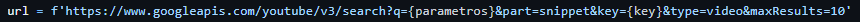
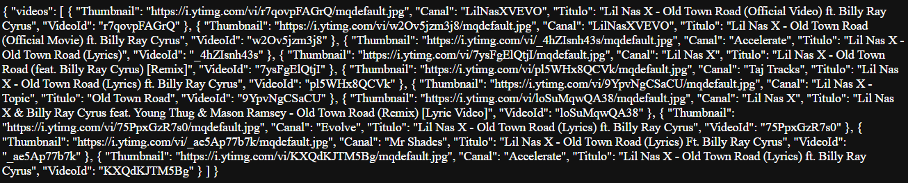

# Youtube API
Código em python utilizando Flask de uma API que permite o download de musicas do Youtube. 
Esta API tem como objetivo a fácil integração em aplicativos e sites, possuindo funções simples capazes de se adaptar a diferentes casos.  
##### Caso você esteja a procura de uma API já pronta para o uso em projetos próprios que não necessitam de velocidade de resposta, sinta-se livre para utilizar a minha.
##### If you are looking for an API ready for use in your own projects that do not require speed of response, feel free to use my.
`https://apiyoutube.eduardoroth1.repl.co`  
- Suas funcionalidades estarão listadas a baixo.
# Explicações iniciais
O objetivo desta API é ser uma aplicação simples e de fácil integração em diferentes cenários. Tem também como objetivo a fácil manutenção e modificação de acordo com as necessidades. 
A ideia principal é a hospedagem da API no <a href="https://replit.com">Replit</a>, caso você deseje hospedar tua própria API no Replit, esteja ciente de que encontrará algumas dificuldades, veja a seção <a href="#hospedar">Hospedagem da API</a>. A hospedagem da mesma é possivel em diferentes sites, não se esqueça de fazer as modificações necessárias.

# Funcionalidades
#### Os tópicos abordados serão:
- <a href="#deletar">Remoção de audios baixados.<a>  
- <a href="#parametros">Parâmetros de pesquisa.<a>  
- <a href="#get_id">Niveis de qualidade.<a>  
- <a href="#down_id">Download por ID.<a>  
- <a href="#down_alto">Download qualidade alta.<a>  
- <a href="#down_meio">Download qualidade media.<a>  
- <a href="#down_baixo">Download qualidade baixa.<a>  

<h2 id="deletar">Remoção de audios baixados</h2>

Toda vez que a API é iniciada, a função `delete_audio()` é chamada para excluir a pasta que contém os arquivos de audio. Esta função é necessária para que não acabe o espaço disponível. Não é necessária a criação da pasta novamente, a mesma é recriada quando o primeiro arquivo for baixado.

<h2 id="parametros">Parâmetros de pesquisa</h2>

A função `buscar_parametros()` não é necessária para o download dos arquivos, mas é um sistema de pesquisa integrado na API. Esta função tem como objetivo mandar uma request para a API oficial do Youtube com o algo que o usuário deseja pesquisar, seja o nome do vídeo, canal, palavras chaves, etc. Logo após, ela faz o tratamento desses dados e devolve como resposta da requisição inicial, um JSON com informações dos 10 primeiros vídeos encontrados, contendo:  

- O link com qualidade média das Thumbnails.  
- Nome do Canal. 
- Titulo do Vídeo. 
- ID do vídeo. 

Duvidas podem ser geradas quanto a definição de "ID do vídeo", esta informação é a sequência de caracteres que correspondem ao vídeo e que ficam localizadas no final de toda URL de vídeos, após a rota `/watch` seguido de `?v=` e então o ID, exemplo: 
- https://www.youtube.com/watch?v= `4-43lLKaqBQ` 

Para a utilização desta função, é necessário o cadastro no site da <a href="https://developers.google.com/youtube/v3?hl=pt-br">API do Youtube</a> duas keys são necessárias, a primeira vai nas configurações da API, onde está escrito `developer_key` coloque sua developer key. 
 
A segunda key vai na URL para a request, local que está escrito `key` coloque a sua request key. 
 
#### Exemplo de requisição e resposta
#### Requisição: 
- https://apiyoutube.eduardoroth1.repl.co/old town road  

#### Resposta:
 

<h2 id="get_id">Niveis de qualidade</h2>
