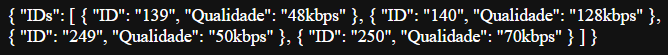
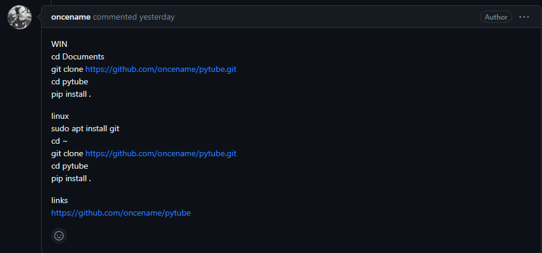
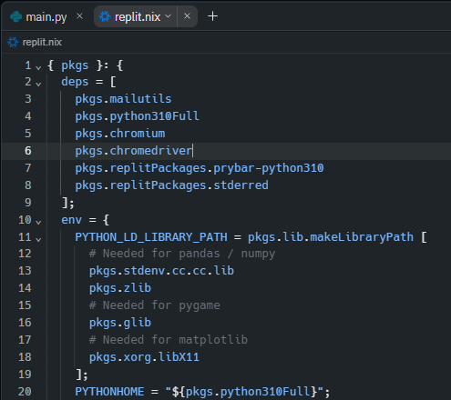

# Youtube API
Código em python utilizando Flask de uma API que permite o download de musicas do Youtube. 
Esta API tem como objetivo a fácil integração em aplicativos e sites, possuindo funções simples capazes de se adaptar a diferentes casos.  
##### Caso você esteja a procura de uma API já pronta para o uso em projetos próprios que não necessitam de velocidade de resposta, sinta-se livre para utilizar a minha.
##### If you are looking for an API ready for use in your own projects that do not require speed of response, feel free to use my.
`https://apiyoutube.eduardoroth1.repl.co`  
- Suas funcionalidades estarão listadas a baixo.
# Explicações iniciais
Até o presente momento (11/10/2023), a API está funcionando, ela pode apresentar erros devido a futuras atualizações da biblioteca utilizada. 
A API disponibilizada a cima está livre para o uso, porém a única função que possui bloqueio para terceiros é a <a href="#parâmetros-de-pesquisa">Parâmetros de pesquisa.<a> por motivos que a API oficial do Youtube possui limite diário de 100 requests.  
O objetivo desta API é ser uma aplicação simples e de fácil integração em diferentes cenários. Tem também como objetivo a fácil manutenção e modificação de acordo com as necessidades.  
A ideia principal é a hospedagem da API no <a href="https://replit.com">Replit</a>, caso você deseje hospedar sua própria API no Replit, esteja ciente de que encontrará algumas dificuldades, veja a seção <a href="#hospedagem-da-api">Hospedagem da API</a>. A hospedagem da mesma é possivel em diferentes sites, não se esqueça de fazer as modificações necessárias. 

# Funcionalidades
#### Os tópicos abordados serão:
- <a href="#instalação-das-ferramentas">Instalação das ferramentas</a>
- <a href="#remoção-de-audios-baixados">Remoção de audios baixados.<a>  
- <a href="#parâmetros-de-pesquisa">Parâmetros de pesquisa.<a>  
- <a href="#niveis-de-qualidade">Niveis de qualidade.<a>  
- <a href="#download-por-id">Download por ID.<a>  
- <a href="#download-qualidade-alta">Download qualidade alta.<a>  
- <a href="#download-qualidade-media">Download qualidade media.<a>  
- <a href="#download-qualidade-baixa">Download qualidade baixa.<a>  
- <a href="#hospedagem-da-api">Hospedagem da API</a>
                                                  
<h1>Instalação das ferramentas</h1
                                
Este projeto necessita de algumas bibliotecas para funcionar, elas são: 
- <a href="https://flask.palletsprojects.com/en/3.0.x/">Flask</a> 
- <a href="https://pytube.io/en/latest/">Pytube</a>
- <a href="https://pypi.org/project/requests/">Request</a>
- <a href="https://docs.python.org/3/library/json.html">JSON</a>
- <a href="https://docs.python.org/3/library/os.html">OS</a>
- <a href="https://docs.python.org/pt-br/3/library/shutil.html">Shutil</a>

Todas as bibliotecas citadas possuem documentação nos links disponibilizados. 
É possivel que problemas ocorram com a biblioteca `Pytube`, principalmente se o projeto estiver sendo feito no Replit, caso isso aconteça, vá na seção <a href="hospedagem-da-api">Hospedagem da API</a>, lá vocÊ pode encontrar mais detalhes

<h1>Remoção de audios baixados</h1>

Toda vez que a API é iniciada, a função `delete_audio()` é chamada para excluir a pasta que contém os arquivos de audio. Esta função é necessária para que não acabe o espaço disponível. Não é necessária a criação da pasta novamente, a mesma é recriada quando o primeiro arquivo for baixado.

<h1>Parâmetros de pesquisa</h1>

A função `buscar_parametros()` não é necessária para o download dos arquivos, mas é um sistema de pesquisa integrado na API. Esta função tem como objetivo mandar uma request para a API oficial do Youtube com o algo que o usuário deseja pesquisar, seja o nome do vídeo, canal, palavras chaves, etc. Logo após, ela faz o tratamento desses dados e devolve como resposta da requisição inicial, um JSON com informações dos 10 primeiros vídeos encontrados, contendo:  

- O link com qualidade média das Thumbnails.  
- Nome do Canal. 
- Titulo do Vídeo. 
- ID do vídeo. 

Duvidas podem ser geradas quanto a definição de "ID do vídeo", esta informação é a sequência de caracteres que correspondem ao vídeo e que ficam localizadas no final de toda URL de vídeos, após a rota `/watch` seguido de `?v=` e então o ID, exemplo: 
- https://www.youtube.com/watch?v= `4-43lLKaqBQ` 

Para a utilização desta função, é necessário o cadastro no site da <a href="https://developers.google.com/youtube/v3?hl=pt-br">API do Youtube</a> duas keys são necessárias, a primeira vai nas configurações da API, onde está escrito `developer_key` coloque sua developer key. 
 
A segunda key vai na URL para a request, local que está escrito `key` coloque a sua request key. 
 
#### Exemplo de requisição e resposta
#### Requisição: 
- https://sua_url_aqui/old town road  

#### Resposta:
 

<h1>Niveis de qualidade</h1>

A função `getids()` tem como objetivo retornar um JSON contendo: 
- Qualidade do audio em kbps. 
- ID. 
A informação `ID` deve ser utilizada na próxima função. Audios com qualidades mais altas necessitam de um maior tempo para o download e envio. 
Para Utilizar esta função, deve-se escrever a rota `/getids` após a URL principal e então adicionar `?` no final para que o código conseguida fazer o tratamento dos dados, após isso deve ser passado o link inteiro do vídeo desejado, note que é possível fazer modificações básicas para que o código aceite apenas o `ID do vídeo`: 
#### Exemplo de requisição e resposta
#### Requisição
- https://sua_url_aqui/getids?https://www.youtube.com/watch?v=SlnrCLivyjM 

#### Resposta

 

<h1>Download por ID</h1>

Esta funcionalidade necessita que você passe dois parametros,primeiramente você passa a rota `/down` e então em seguida vem os parametros, o primeiro é o ID da qualidade desejada que você encontra em <a href="#niveis-de-qualidade">Niveis de qualidade</a> e o segundo é o link do vídeo que você deseja baixar.
#### Exemplo de requisição e resposta
#### Requisição: 
- https://sua_url_aqui/down/250?https://www.youtube.com/watch?v=-59jGD4WrmE

#### Resposta:
- Arquivo MP3 que contém o audio do video escolhido.

<h1>Download qualidade alta</h1>

Esta funcionalida serve para fazer o download com a maior qualidade disponivel, em alguns poucos videos, a qualidade mais alta, `128kbps`, não está disponivel, neste caso, o código mostra no console um aviso e tenta baixar na menor qualidade possivel,pois todos os videos possuem esta opção de download. 
Basta colocar a URL principal, a rota `/downalto` seguido de `?` e então o link completo do vídeo.
#### Exemplo de requisição e resposta
#### Requisição: 
- https://sua_url_aqui/downalto?https://www.youtube.com/watch?v=vtNJMAyeP0s

#### Resposta:
- Arquivo MP3 que contém o audio do video escolhido.

<h1>Download qualidade media</h1>

Esta funcionalida serve para fazer o download com a qualidade média, em alguns poucos videos, a qualidade média, `70kbps`, não está disponivel, neste caso, o código mostra no console um aviso e tenta baixar na menor qualidade possivel,pois todos os videos possuem esta opção de download. 
Basta colocar a URL principal, a rota `/downmedio` seguido de `?` e então o link completo do vídeo.
#### Exemplo de requisição e resposta
#### Requisição: 
- https://sua_url_aqui/downmedio?https://www.youtube.com/watch?v=vtNJMAyeP0s

#### Resposta:
- Arquivo MP3 que contém o audio do video escolhido.

<h1>Download qualidade baixa</h1>

Esta funcionalida serve para você fazer o download com a menor qualidade disponivel `48kbps`, 
Basta colocar a URL principal, a rota `/downbaixo` seguido de `?` e então o link completo do vídeo.
#### Exemplo de requisição e resposta
#### Requisição: 
- https://sua_url_aqui/downbaixo?https://www.youtube.com/watch?v=vtNJMAyeP0s

#### Resposta:
- Arquivo MP3 que contém o audio do video escolhido.

<h1>Hospedagem da API</h1>

A biblioteca `Pytube` foi feita para fazer o download de vídeos do Youtube, porém devido a constantes atualizações de código do Youtube esta prática acaba ficando mais dificil, então é possivel que ao fazer o download padrão da biblioteca não funcione, segue a baixo uma maneira de tentar solucionar o problema. 

  

#### Replit

Caso o projeto esteja sendo feito no Replit, é recomendado que seja começado com o template `Flask`, pois ele já possui as configurações iniciais necessárias para o acesso da API remotamente por toda a internet. 
Logo após, faça o passo a cima caso não funcione o download padrão e então vá em `Files` e clique em `Show hidden files`, irá aparecer novos arquivos antes escondidos. 
Encontre o arquivo `replit.nix` e modifique o `deps` como está na imagem a baixo. 

